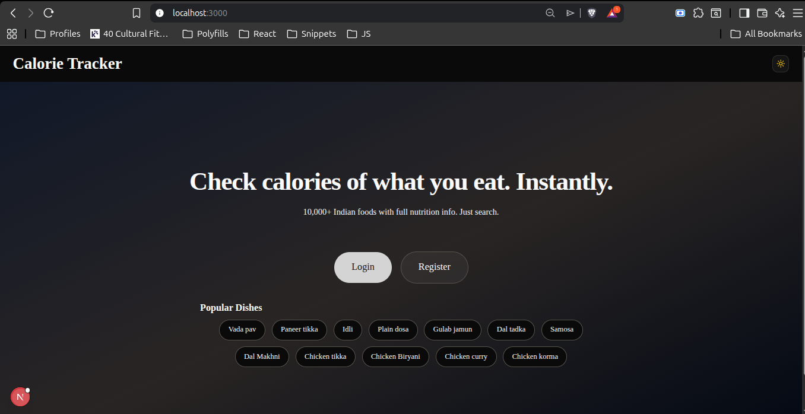
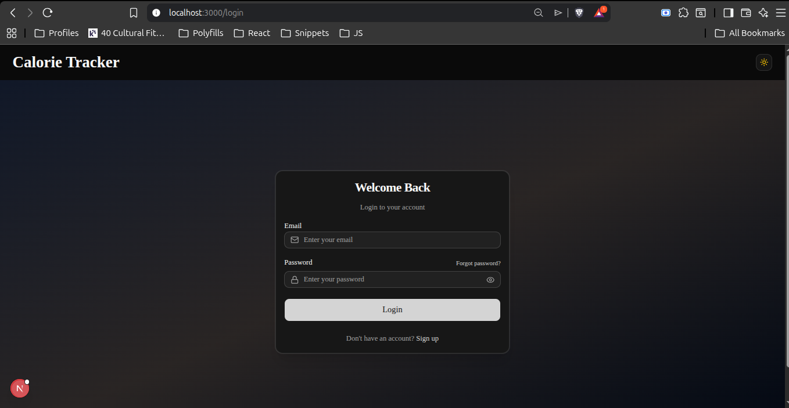
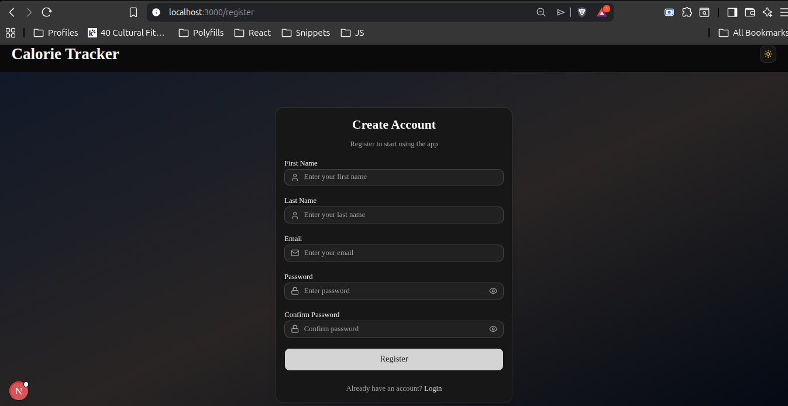
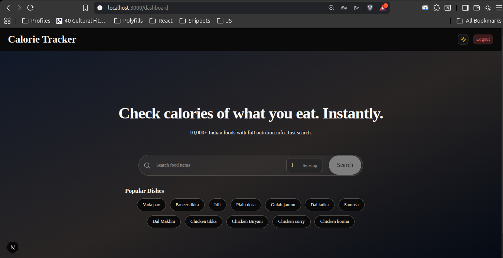
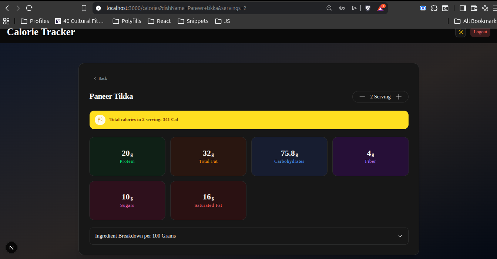
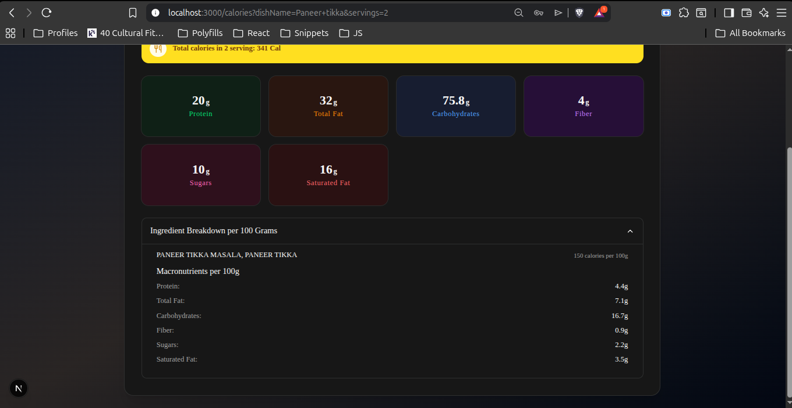
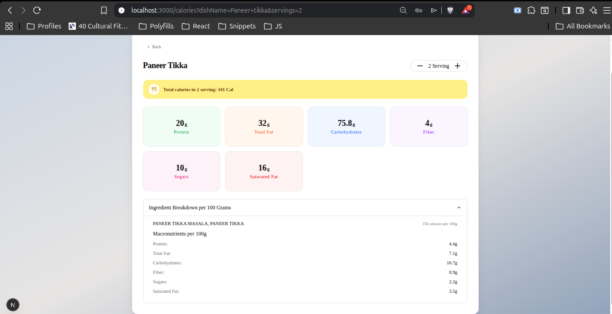

# Meal Calorie Tracker

A comprehensive web application for tracking calories and nutritional information of Indian foods. Built with Next.js, TypeScript, and Tailwind CSS, this app provides instant access to calorie data for over 10,000+ Indian food items with detailed macronutrient breakdowns.

## Features

- **🔍 Instant Food Search**: Search from a database of 10,000+ Indian foods
- **📊 Detailed Nutrition Info**: View calories, macronutrients, and ingredient breakdowns
- **🍽️ Popular Dishes**: Quick access to commonly searched Indian dishes
- **👤 User Authentication**: Secure login and registration system
- **📱 Responsive Design**: Optimized for desktop and mobile devices
- **🌙 Dark Mode Support**: Automatic dark/light theme switching
- **📈 Serving Size Calculator**: Adjust calories based on serving portions

## Tech Stack

- **Frontend**: Next.js 14 with App Router
- **Language**: TypeScript
- **Styling**: Tailwind CSS
- **UI Components**: shadcn/ui
- **Authentication**: NextAuth.js
- **Forms**: React Hook Form with Zod validation
- **Icons**: Lucide React
- **API Integration**: RESTful API for nutrition data

## Prerequisites

- Node.js 18+
- npm, yarn, pnpm, or bun
- Environment variables configured for API endpoints

## Getting Started

### 1. Clone the Repository

```bash
git clone <repository-url>
cd meal-calorie-frontend-vivek-prajapati
```

### 2. Install Dependencies

```bash
npm install
# or
yarn install
# or
pnpm install
# or
bun install
```

### 3. Environment Setup

Create a `.env.local` file in the root directory:

```env
# API Configuration
NEXT_PUBLIC_API_BASE_URL=https://your-api-base-url.com/

# NextAuth Configuration (if using authentication)
NEXTAUTH_URL=http://localhost:3000
NEXTAUTH_SECRET=your-secret-key

# Optional: Database or other service URLs
```

### 4. Run the Development Server

```bash
npm run dev
# or
yarn dev
# or
pnpm dev
# or
bun dev
```

Open [http://localhost:3000](http://localhost:3000) with your browser to see the application.

## Project Structure

```
src/
├── app/                    # Next.js App Router pages
│   ├── api/               # API routes
│   ├── calories/           # Calories search results page
│   ├── dashboard/          # Main search dashboard
│   ├── login/             # User login page
│   ├── register/          # User registration page
│   └── layout.tsx         # Root layout component
├── components/
│   ├── common/            # Reusable common components
│   │   ├── PopularDishes.tsx
│   │   ├── CaloriesContent.tsx
│   │   ├── NutrientTable.tsx
│   │   └── ...
│   └── ui/                # shadcn/ui components
├── actions/               # Server actions
├── hooks/                 # Custom React hooks
├── types/                 # TypeScript type definitions
└── lib/                   # Utility functions
```

## Key Components

- **Dashboard**: Main search interface with popular dishes
- **CaloriesContent**: Displays detailed nutritional information
- **PopularDishes**: Quick access buttons for common Indian foods
- **AuthPages**: Login and registration with form validation
- **Ingredient Breakdown**: Accordion-style detailed nutrient information

## Screenshots









## API Integration

The application integrates with a nutrition API to provide:

- Food calorie information
- Macronutrient breakdowns (protein, carbs, fats, fiber, etc.)
- Ingredient-level details
- Serving size calculations

## Build for Production

```bash
npm run build
npm start
```

## Backend API Support

For detailed API documentation and backend setup instructions, please refer to:
[Backend API Documentation](https://www.notion.so/XcelPros-Meal-Calorie-Count-Generator-Frontend-Assignment-3175fbc50a1081a199c5e41cc95fb385#3175fbc50a10810aa3bdfd50e2e047f9)
